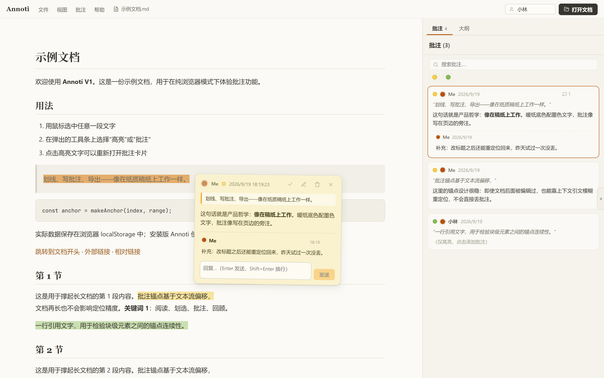

# Annoti

Annoti 是一个本地优先的文档批注工具：打开文档，像在稿纸上一样划线、写批注、贴便签、围绕批注讨论、与朋友交换批注并离线合并。



当前开发进度 **2.2.0-alpha**（V2.2：文本格式大扩展，本地测试中）。三阶段规划（V1 → V2 → V3）基于 Wails v2，架构与设计决策：[doc/v1-architecture.md](doc/v1-architecture.md)（V1 核心）与 [doc/v2-architecture.md](doc/v2-architecture.md)（V2 增量）。

## 功能

- **多格式打开**：`.md` / `.txt` / `.html` / `.json` / `.xml` / `.csv` / `.tsv` / `.epub`，配置家族 `.yaml` / `.yml` / `.toml` / `.ini` / `.cfg` / `.conf` / `.properties` / `.env`，标记语言 `.rst` / `.adoc` / `.org` / `.tex`，以及 `.diff` / `.patch` / `.log` / `.jsonl` / `.ndjson`——统一渲染层输出规范 DOM，锚点引擎对格式无感；JSON 缩进美化、XML/JSON/配置家族/标记语言语法着色（照排不重排，注释保留）、CSV/TSV 渲染为表格、diff 增删行着色、log 级别高亮、JSONL 逐行着色；EPUB 按 spine 顺序逐章渲染（解析到本地缓存，章节目录进大纲）
- **编码自动检测**：UTF-8 / UTF-16 / GB18030（GBK）文本直接打开，Excel 导出的 GBK CSV 无乱码
- **高亮**：划选文字，五色色点（黄 / 绿 / 蓝 / 粉 / 橙）一键高亮；基于 CSS Custom Highlight API，不修改文档 DOM
- **批注**：正文支持 Markdown 与本地图片（编辑 + 预览）；点击高亮即可打开
- **区域批注（框选）**：Ctrl+G 进入框选模式，图片 / 文本块 / 空白区域均可画框——图片锚 src 零漂移，文本块锚内容抗回流，空白处为页面叠加层（扫描件 PDF 等无文本文档的唯一锚定方式，为 V3 铺路）
- **便签**：每条批注可同时摊开一张便签——点空白处不消失、按下置顶、头部拖拽且位置跨会话记忆，只有显式关闭才收走
- **讨论串**：任意批注可直接回复，形成可分支的讨论树；根批注标记「已解决」即折叠整串；HTML 文档内链接交给系统浏览器打开
- **多作者**：作者色按人稳定（便签 / 侧栏一致），多人讨论一眼可分；侧栏可按作者 / 关键字 / 高亮颜色筛选，可隐藏已解决
- **审阅与定位**：侧栏线程树点击定位（滚动居中 + 闪烁）；锚点带引文上下文，文档被修改后自动模糊重定位，定位失败标记失效而不是丢数据
- **阅读工具**：文内查找（Ctrl+F，高亮全部匹配 + 计数跳转）、字号缩放（Ctrl+滚轮 / Ctrl+=/-/0）、大纲导航（Markdown/HTML 标题树、EPUB 章节目录）、应用内菜单栏 + 快捷键、最近打开列表、拖拽文件到窗口打开、长文档按需渲染（content-visibility）
- **导入导出**：`.annoti.json` 批注包（格式 v2，向下兼容 v1）：根批注按作者+引文去重，回复按 ID 合并、新者胜出，讨论串跨设备离线合并；区域批注为 v2 格式的加法扩展，旧版本导入时自动降级为文本批注
- **日常**：启动自动恢复上次文档；亮 / 暗主题（暖纸 × 墨色的"稿纸"设计语言）；窗口大小位置记忆

## 技术栈

- **桌面壳**：[Wails v2](https://wails.io)（Go + 系统 WebView2，不捆绑浏览器引擎）
- **后端**：Go + SQLite（`modernc.org/sqlite`，纯 Go 无 CGO）
- **前端**：Vue 3 + TypeScript + Vite；图标为内联 SVG，界面无 emoji
- **锚点**：W3C Web Annotation 风格（文本位置 + 引文上下文，支持模糊重定位）

## 下载

前往 [Releases](https://github.com/AkutaZehy/Annoti/releases) 下载最新版 `annoti.exe`（Windows 10/11，需系统 WebView2 运行时）。提供 SHA256 校验文件。

> 从 v1.0.0-delta 升级：各版本数据目录相互独立（见下），先在旧版中导出 `.annoti.json`，再在新版中导入即可。

## 开发

环境要求：Go 1.24+、Node 20+、pnpm、[Wails CLI](https://wails.io/docs/gettingstarted/installation)（`go install github.com/wailsapp/wails/v2/cmd/wails@latest`）。

```bash
# 安装依赖
cd frontend && pnpm install && cd ..

# 开发模式（前端热更新）
wails dev

# 测试
go test ./...                  # 后端：存储 / 交换包与合并 / 编码检测 / 本地资源端点
cd frontend && pnpm test       # 前端：锚点引擎 / 渲染层 / 讨论串 / 图片路径解析

# 发布
scripts/release.sh --dry-run   # 全流程演练（质量门→构建→冒烟→打包，不发布）
scripts/release.sh --notes <发布说明.md>   # 正式发布，见 doc/RELEASE.md
```

纯浏览器开发（不起 Wails）：`cd frontend && pnpm dev`，自动使用内置示例文档与
localStorage 存储。

## 数据位置

`%APPDATA%\AnnotiV2\`（`annoti.db` 数据库 + `settings.json` 设置）。顶栏数据目录按钮可直接打开。上一代（v1.0.0-delta）使用 `%APPDATA%\AnnotiV1\`，两代可并排安装。

## 版本规划

| 版本 | 主题 | 状态 |
|------|------|------|
| V1 | 核心批注引擎（md/txt，SQLite，交换格式） | 1.0.0-delta |
| V2 | 多格式（html/json/xml/csv）+ 离线讨论串 + 多作者 | 2.0.0-alpha |
| V2.1 | 区域批注（框选）+ EPUB + 阅读工具（查找/缩放/大纲/菜单） | 2.1.2-alpha |
| V2.2 | 文本格式大扩展：配置家族（yaml/toml/ini/env）、标记语言（rst/adoc/org/tex）、diff/log/jsonl/tsv 照排渲染 | **2.2.0-alpha（当前）** |
| V3 | PDF + 手绘图例 + 长文本深度优化 | 规划中 |

各版本为独立稳定产品，相互不兼容。历史 Tauri 实现存档于
[`archive/1.0.0-dev-tauri`](https://github.com/AkutaZehy/Annoti/tree/archive/1.0.0-dev-tauri)
分支；更早期文档见 `doc/`。

## 贡献

**暂时关闭**：本项目目前暂停接受贡献（PR / Issue / 功能请求）。

## 许可证

MIT License
