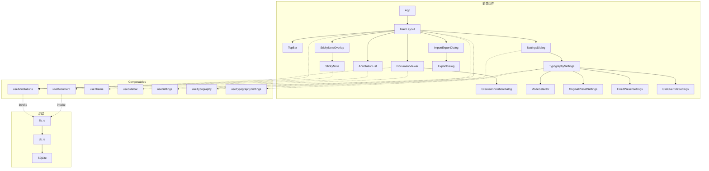
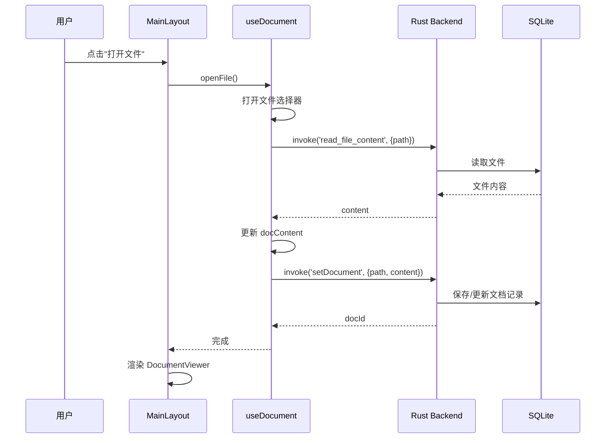
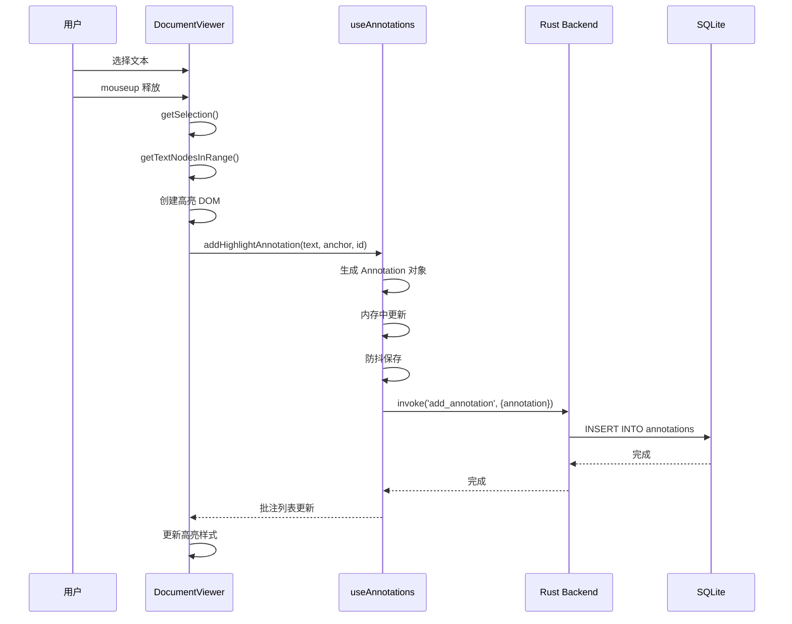
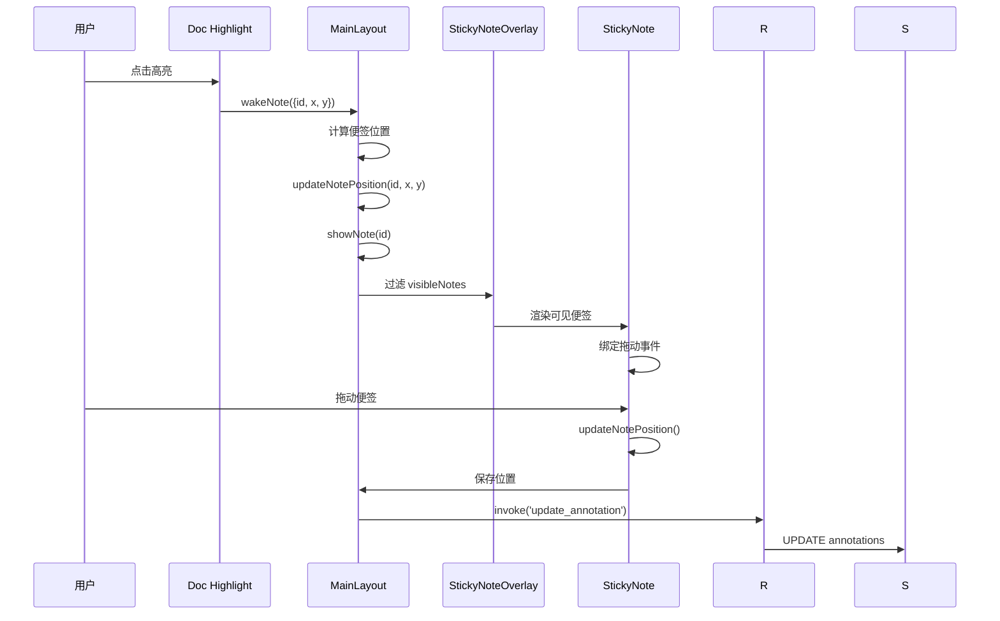

# Annoti 项目架构文档

本文档介绍 Annoti 项目的整体架构、技术栈和组织方式。

---

## 1. 项目概述

### 1.1 产品介绍

**Annoti** 是一个基于 Tauri 的本地文档批注工具，主要特性：

- **文档批注**：支持 Markdown/HTML 渲染、固定宽度文本模式
- **高亮批注**：在文档中选择文本进行高亮，支持自定义颜色和样式
- **便签系统**：为高亮内容添加便签，支持拖拽移动和自由调整大小
- **导入导出**：支持单独或批量导出/导入批注
- **主题系统**：深色/浅色模式切换
- **排版配置**：灵活的排版设置，支持 Original/Fixed/Pro 三种模式

### 1.2 版本信息

| 项目 | 版本 |
|------|------|
| 当前版本 | 1.0.0-dev |
| Tauri | 2.x |
| Vue | 3.x |
| Rust | 1.70+ |

---

## 2. 技术栈

### 2.1 技术选型

| 层级 | 技术选型 | 说明 |
|------|----------|------|
| 前端框架 | Vue 3.5 | Composition API |
| 语言 | TypeScript 5.6 | 类型安全 |
| 桌面框架 | Tauri 2 | Rust 后端 |
| 状态管理 | Vue ref (Composable) | 轻量级状态管理 |
| Markdown | marked 17.x | Markdown 渲染 |
| 数据库 | SQLite (rusqlite) | 本地数据存储 |
| 样式 | 原生 CSS + CSS Variables | 主题支持 |
| AI Agent | Claude Code Router + MiniMax-M2.1(chatcompletion-v2) | 开发辅助 |

### 2.2 技术架构图

```
┌─────────────────────────────────────────────────────────────────┐
│                         Annoti 应用                              │
├─────────────────────────────────────────────────────────────────┤
│  ┌─────────────────────────────────────────────────────────┐   │
│  │                    前端层 (Vue 3)                        │   │
│  │  ┌─────────────┐ ┌─────────────┐ ┌─────────────────┐    │   │
│  │  │  Components │ │ Composables │ │    Styles       │    │   │
│  │  │  视图组件    │ │  业务逻辑   │ │   CSS变量主题   │    │   │
│  │  └─────────────┘ └─────────────┘ └─────────────────┘    │   │
│  └─────────────────────────────────────────────────────────┘   │
│                            │                                    │
│                     Tauri Invoke API                            │
│                            │                                    │
│  ┌─────────────────────────────────────────────────────────┐   │
│  │                    后端层 (Rust)                         │   │
│  │  ┌─────────────┐ ┌─────────────┐ ┌─────────────────┐    │   │
│  │  │   lib.rs    │ │   db.rs     │ │   main.rs       │    │   │
│  │  │  命令定义    │ │  数据库操作 │ │   程序入口      │    │   │
│  │  └─────────────┘ └─────────────┘ └─────────────────┘    │   │
│  └─────────────────────────────────────────────────────────┘   │
│                            │                                    │
│                     rusqlite / std::fs                         │
│                            │                                    │
│  ┌─────────────────────────────────────────────────────────┐   │
│  │                    数据层                                │   │
│  │  ┌─────────────────┐  ┌─────────────────────────────┐   │   │
│  │  │  SQLite 数据库   │  │   配置文件 (JSON/YAML)      │   │   │
│  │  │  data.db        │  │   settings.json             │   │   │
│  │  │                 │  │   typography.yaml            │   │   │
│  │  └─────────────────┘  └─────────────────────────────┘   │   │
│  └─────────────────────────────────────────────────────────┘   │
└─────────────────────────────────────────────────────────────────┘
```

---

## 3. 目录结构

```
Annoti/
├── src/                          # 前端源码
│   ├── App.vue                   # 根组件
│   ├── main.ts                   # 应用入口
│   ├── components/               # Vue 组件
│   │   ├── MainLayout.vue        # 主布局（协调各组件）
│   │   ├── DocumentViewer.vue    # Markdown 文档查看器
│   │   ├── TextViewer.vue        # Fixed 模式纯文本查看器
│   │   ├── AnnotationList.vue    # 侧边栏批注列表
│   │   ├── StickyNote.vue        # 单个便签组件
│   │   ├── StickyNoteOverlay.vue # 便签容器层
│   │   ├── TopBar.vue            # 顶部工具栏
│   │   ├── CreateAnnotationDialog.vue  # 创建批注对话框
│   │   ├── ExportDialog.vue      # 导出对话框
│   │   ├── ImportExportDialog.vue # 导入导出对话框
│   │   ├── SettingsDialog.vue    # 设置对话框
│   │   ├── TypographySettings.vue # 排版设置面板
│   │   ├── ExportSuccessToast.vue # 导出成功提示
│   │   └── typography/           # 排版设置子组件
│   │       ├── ModeSelector.vue           # 模式选择器
│   │       ├── OriginalPresetSettings.vue # Original 预设
│   │       ├── FixedPresetSettings.vue    # Fixed 预设
│   │       ├── CssOverrideSettings.vue    # CSS 覆盖
│   │       ├── PendingChanges.vue         # 待处理更改
│   │       └── WarningDialog.vue          # 警告对话框
│   ├── composables/              # Vue 组合式函数
│   │   ├── useDocument.ts        # 文档加载和管理
│   │   ├── useAnnotations.ts     # 批注状态管理
│   │   ├── useSettings.ts        # 设置状态管理
│   │   ├── useTypography.ts      # 排版状态管理
│   │   ├── useTypographySettings.ts # 排版设置管理
│   │   ├── useTheme.ts           # 主题切换
│   │   ├── useSidebar.ts         # 侧边栏状态
│   │   └── useWindow.ts          # 窗口状态
│   ├── styles/                   # CSS 样式
│   │   ├── typography.css        # 排版 CSS 变量
│   │   ├── original.css          # Original 预设样式
│   │   ├── fixed.css             # Fixed 预设样式
│   │   ├── theme-dark.css        # 暗色主题
│   │   └── theme-light.css       # 亮色主题
│   ├── types/                    # TypeScript 类型定义
│   │   ├── index.ts              # 公共类型
│   │   ├── typography.ts         # 排版类型
│   │   └── theme.ts              # 主题类型
│   ├── utils/                    # 工具函数
│   │   └── typographyRenderer.ts # 排版渲染器
│   └── vite-env.d.ts             # Vite 类型声明
│
├── src-tauri/                    # Tauri 后端源码
│   ├── Cargo.toml                # Rust 依赖配置
│   ├── tauri.conf.json           # Tauri 配置文件
│   ├── Cargo.lock                # Cargo 锁定文件
│   ├── src/
│   │   ├── main.rs               # 程序入口
│   │   ├── lib.rs                # Tauri 命令定义
│   │   └── db.rs                 # 数据库操作
│   ├── icons/                    # 应用图标
│   └── typography.yaml           # 默认排版配置
│
├── doc/                          # 项目文档
│   ├── core.md                   # 核心算法文档
│   ├── project.md                # 项目架构文档
│   └── log-20260113.md           # Bug-fix 日志
│
├── dist/                         # 构建输出
├── public/                       # 静态资源
├── package.json                  # Node.js 依赖
├── pnpm-lock.yaml                # pnpm 锁定文件
├── vite.config.ts                # Vite 配置
├── tsconfig.json                 # TypeScript 配置
└── README.md                     # 项目说明
```

---

## 4. 架构设计

### 4.1 前端架构 (MVVM 变体)

```
┌─────────────────────────────────────────────────────────────┐
│                      View (组件)                             │
│  ┌─────────────────────────────────────────────────────┐   │
│  │  <template>                                         │   │
│  │    <DocumentViewer @wakeNote="onWakeNote" />       │   │
│  │    <StickyNoteOverlay :annotations="annotations" />│   │
│  │  </template>                                        │   │
│  └─────────────────────────────────────────────────────┘   │
│                           │                                  │
│                    Vue 事件/Prop                            │
│                           │                                  │
│  ┌─────────────────────────────────────────────────────┐   │
│  │                    ViewModel (Script)               │   │
│  │  const { annotations, showNote } = useAnnotations() │   │
│  │  const onWakeNote = (payload) => { ... }           │   │
│  └─────────────────────────────────────────────────────┘   │
│                           │                                  │
│                   Composables 调用                         │
│                           │                                  │
│  ┌─────────────────────────────────────────────────────┐   │
│  │                  Model (Composable)                 │   │
│  │  export function useAnnotations() {                 │   │
│  │    const annotations = ref([])                      │   │
│  │    const showNote = async (id) => { ... }          │   │
│  │    return { annotations, showNote }                 │   │
│  │  }                                                  │   │
│  └─────────────────────────────────────────────────────┘   │
└─────────────────────────────────────────────────────────────┘
```

### 4.2 数据流图

```
                    用户操作
                        │
                        ▼
┌──────────────┐   ┌──────────────────┐   ┌──────────────────┐
│   Document   │──▶│  DocumentViewer  │──▶│   Selection      │
│   Content    │   │                  │   │   (DOM API)      │
└──────────────┘   └──────────────────┘   └──────────────────┘
                        │                        │
                        │    getSelection()      │
                        └────────────────────────┘
                                    │
                                    ▼
                         ┌──────────────────────┐
                         │   createHighlight()  │
                         │   (DOM 操作 + 锚点)   │
                         └──────────────────────┘
                                    │
                                    ▼
                         ┌──────────────────────┐
                         │   useAnnotations()   │
                         │   (状态管理)         │
                         └──────────────────────┘
                                    │
                        ┌───────────┴───────────┐
                        │                       │
                        ▼                       ▼
             ┌──────────────────┐    ┌──────────────────┐
             │  StickyNote      │    │  AnnotationList  │
             │  (便签显示)       │    │  (侧边栏列表)     │
             └──────────────────┘    └──────────────────┘
                        │                       │
                        │       Tauri Invoke    │
                        └───────────┬───────────┘
                                    │
                                    ▼
                         ┌──────────────────────┐
                         │   Rust Backend       │
                         │   (db.rs)            │
                         └──────────────────────┘
                                    │
                                    ▼
                         ┌──────────────────────┐
                         │   SQLite Database    │
                         │   (data.db)          │
                         └──────────────────────┘
```

### 4.3 组件关系图



### 4.4 批注锚点系统

```
用户选择: "Hello 世界"

DOM 结构:
┌─────────────────────────────────────┐
│ <p>                                 │
│   <span>Hello </span>               │ ◄── textNode[0]
│   <strong>世界</strong>             │ ◄── 非文本节点，跳过
│ </p>                                │
│ <p>                                 │
│   <span>你好</span>                 │ ◄── textNode[1]
│ </p>                                │
└─────────────────────────────────────┘

锚点记录:
┌─────────────────────────────────────────────────────┐
│ anchor: [                                           │
│   {                                                  │
│     containerPath: "p:nth-child(1) > span:nth-child(1)", │
│     textNodeIndex: 0,                                │
│     startOffset: 0,                                  │
│     endOffset: 6                                     │
│   },                                                 │
│   {                                                  │
│     containerPath: "p:nth-child(2) > span:nth-child(1)", │
│     textNodeIndex: 0,                                │
│     startOffset: 0,                                  │
│     endOffset: 2                                     │
│   }                                                  │
│ ]                                                    │
└─────────────────────────────────────────────────────┘
```

---

## 5. 核心模块详解

### 5.1 文档加载流程



### 5.2 批注创建流程



### 5.3 便签系统流程



---

## 6. 数据模型

### 6.1 Annotation 类型定义

```typescript
// src/types/index.ts

export interface Annotation {
    id: string;
    userId: string;
    userName: string;
    text: string;           // 被高亮的原文
    note: string;           // 便签内容
    anchor: AnnotationAnchor[];
    highlightColor: string;
    highlightType: 'underline' | 'square';
    noteVisible: boolean;
    notePosition: { x: number; y: number };
    noteSize: { width: number; height: number };
    createdAt: number;
}

export interface AnnotationAnchor {
    containerPath: string;  // CSS 选择器路径
    textNodeIndex: number;  // 父元素内文本节点索引
    startOffset: number;    // 起始偏移
    endOffset: number;      // 结束偏移
}
```

### 6.2 数据库 Schema

```sql
-- 用户表
CREATE TABLE users (
    id TEXT PRIMARY KEY,
    name TEXT NOT NULL,
    created_at INTEGER
);

-- 文档表
CREATE TABLE documents (
    id TEXT PRIMARY KEY,
    path TEXT UNIQUE NOT NULL,
    content TEXT NOT NULL,
    checksum TEXT NOT NULL,
    last_modified INTEGER,
    created_at INTEGER
);

-- 批注表
CREATE TABLE annotations (
    id TEXT PRIMARY KEY,
    document_id TEXT NOT NULL,
    user_id TEXT NOT NULL,
    user_name TEXT NOT NULL,
    text TEXT NOT NULL,
    note TEXT,
    note_visible INTEGER DEFAULT 0,
    note_position_x REAL DEFAULT 0,
    note_position_y REAL DEFAULT 0,
    note_width REAL DEFAULT 280,
    note_height REAL DEFAULT 180,
    highlight_color TEXT DEFAULT '#ffd700',
    highlight_type TEXT DEFAULT 'underline',
    anchor_data TEXT NOT NULL,
    created_at INTEGER,
    updated_at INTEGER,
    FOREIGN KEY (document_id) REFERENCES documents(id),
    FOREIGN KEY (user_id) REFERENCES users(id)
);

CREATE INDEX idx_annotations_doc ON annotations(document_id);
CREATE INDEX idx_annotations_user ON annotations(user_id);
```

---

## 7. 配置文件

### 7.1 tauri.conf.json

```json
{
    "$schema": "https://schema.tauri.app/config/2",
    "productName": "annoti",
    "version": "1.0.0",
    "identifier": "com.akuta.annoti",
    "build": {
        "beforeDevCommand": "pnpm dev",
        "devUrl": "http://localhost:1420",
        "beforeBuildCommand": "pnpm build",
        "frontendDist": "../dist"
    },
    "app": {
        "windows": [{
            "title": "annoti",
            "width": 800,
            "height": 600
        }],
        "security": {
            "csp": null
        }
    },
    "bundle": {
        "active": true,
        "targets": "msi",
        "icon": [
            "icons/32x32.png",
            "icons/128x128.png",
            "icons/128x128@2x.png",
            "icons/icon.icns",
            "icons/icon.ico"
        ]
    }
}
```

> ！Windows MSI（WiX）对版本号有硬性限制，不允许使用`1.0.0-dev`的形式。

### 7.2 typography.yaml

```yaml
# 排版配置
preset: original
use_css_override: false
custom_css: ""

presets:
  original:
    font_family: system-ui, -apple-system, sans-serif
    font_size: 16
    font_weight: 400
    line_height: 1.8
    text_align: left
    # ... 更多设置

  fixed:
    line_width: 33
    cjk_char_width: 1.0
    non_cjk_char_width: 0.5
    # ... 更多设置
```

---

## 8. 构建与发布

### 8.1 开发模式

```bash
# 安装依赖
pnpm install

# 启动开发服务器
pnpm tauri dev
```

### 8.2 构建发布版

```bash
# 构建前端
pnpm build

# 构建 Tauri 应用
pnpm tauri build

# 输出位置
# src-tauri/target/release/bundle/msi/Annoti_1.0.0-dev_x64.msi
```

---

## 9. 扩展指南

### 9.1 添加新组件

1. 在 `src/components/` 创建 `.vue` 文件
2. 使用 Composition API 定义逻辑
3. 通过 `defineExpose()` 暴露方法（如果需要父组件调用）
4. 在父组件中引入使用

### 9.2 添加新 Composable

1. 在 `src/composables/` 创建 `.ts` 文件
2. 定义响应式状态 (`ref`, `computed`)
3. 封装业务逻辑函数
4. 返回供组件使用的状态和方法
5. 在组件中引入使用

### 9.3 添加后端命令

1. 在 `src-tauri/src/lib.rs` 添加 `#[tauri::command]` 函数
2. 在 `db.rs` 实现数据库操作（如需要）
3. 在前端的 composable 中通过 `invoke()` 调用

---

## 10. 常见问题

| 问题 | 解决方案 |
|------|----------|
| 高亮选区跨越多个节点 | 使用 TreeWalker 遍历，拆分为单节点子范围 |
| 便签位置在滚动后错位 | 使用 `clickY + scrollTop` 计算内容坐标 |
| 频繁保存影响性能 | 使用 500ms 防抖延迟保存 |
| 主题在生产构建不生效 | 确保 CSS 变量在 `:root` 定义 |
| CJK 字符对齐不准 | 使用字符宽度映射表计算视觉宽度 |

---

*文档创建日期: 2026-01-13*
